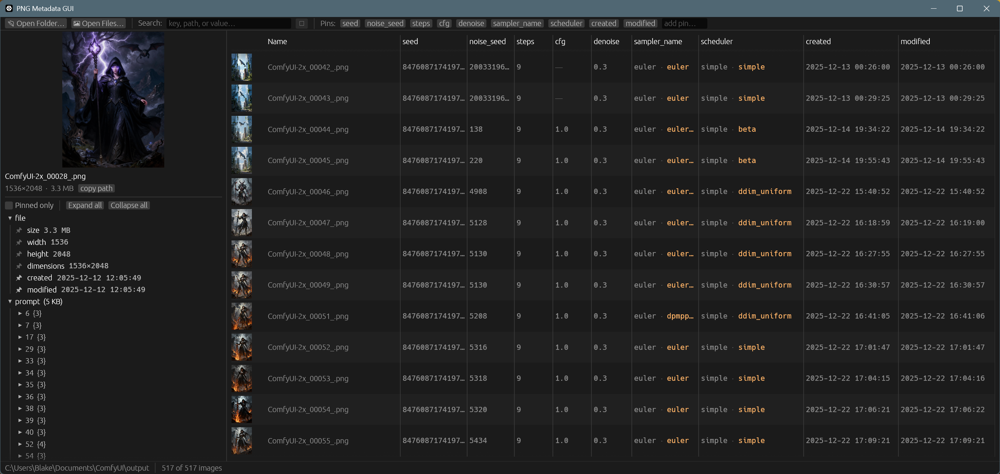

# PNG Metadata GUI



A fast, cross-platform desktop viewer for PNG text chunks (`tEXt`, `zTXt`,
`iTXt`), built for browsing ComfyUI and Stable Diffusion metadata.

Open a folder and every image appears in a table with a sortable column for
each pinned field (seed, steps, cfg, denoise, and so on). Select an image to
browse its metadata as a tree where any value copies with a click. Search
filters the folder to images whose metadata matches. Useful for A/B testing:
see the settings for a whole folder at once instead of inspecting images one
at a time.

Written in Rust with [egui](https://github.com/emilk/egui). Single small
binary, instant startup, no browser engine.

## Features

- Folder table with thumbnails and a sortable column per pinned field
- Pin a key (`cfg`, matches every location), an exact path
  (`prompt.183.inputs.cfg`), or — for ComfyUI images — a **node title**
  ("Positive Prompt"), which follows the node's `_meta.title` and keeps
  working across workflows whose node ids differ
- Rename any pin chip (right-click → Rename) to control its column header
- Repeated keys (generation vs upscale `cfg`) show every value, color-coded,
  with full paths in the tooltip
- Live search over keys, values, and dotted paths; the metadata tree prunes
  to matches while staying collapsible
- Find box that jumps to a field in the tree — matching a node title opens
  the whole node; Enter cycles through matches
- Collapsible JSON tree with expand/collapse all, copy buttons, and
  click-to-copy values
- File size, dimensions, and created/modified dates are pinnable rows, so
  date columns and size sorting work like any tag
- Folders scan in the background with progress, and a per-folder metadata
  cache makes reopening a folder near-instant (files revalidate by size +
  modified time; only changed files are re-read)
- Reopens your last folder on launch
- Drag and drop a folder or PNG onto the window; also works with `Open with`
  or a path argument
- Reads metadata without decoding pixels; thumbnails decode in the
  background with a bounded texture cache
- Handles ComfyUI `prompt` and `workflow` JSON (including Python-style `NaN`
  and non-ASCII text), plain `key=value` chunks, and custom keywords

## Install

Download a binary from [Releases](../../releases) for Windows, macOS, or
Linux. Unzip and run.

Or build from source with [Rust](https://rustup.rs):

```bash
git clone https://github.com/Blakeem/png-metadata-gui
cd png-metadata-gui
cargo build --release
```

Linux needs GTK3 headers for the file dialog: `sudo apt install libgtk-3-dev`

## Usage

```bash
png-metadata-gui                     # open empty, then drop a folder in
png-metadata-gui path/to/folder      # open a folder
png-metadata-gui image.png           # inspect one file
png-metadata-gui --dump image.png    # print flattened rows (debug builds)
```

Click a row to select it. Arrow keys navigate. Click any value to copy it.
Right-click pin chips in the toolbar to rename, reorder, or remove them.
The ⚙ button next to the pin box holds settings (ComfyUI title pins).

Settings, pins, and the folder metadata cache live in your per-user app-data
directory (`%APPDATA%\PNG Metadata GUI` on Windows) — the executable itself
stays standalone.

## Development

```bash
cargo test
cargo clippy --all-targets   # lints are deny-by-default, keep it clean
```

Pushing a tag like `v0.1.0` builds all platforms and attaches the binaries to
a GitHub Release.

## License

[MIT](LICENSE)
